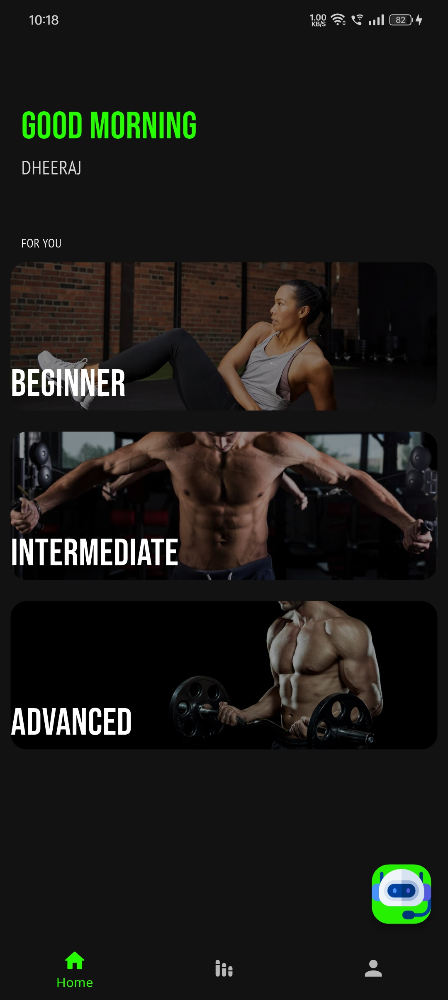
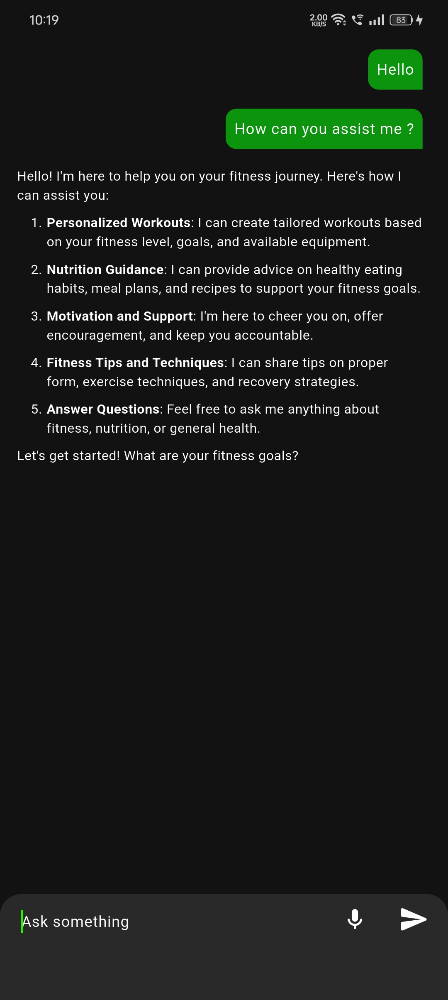
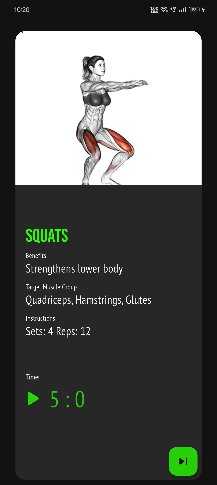
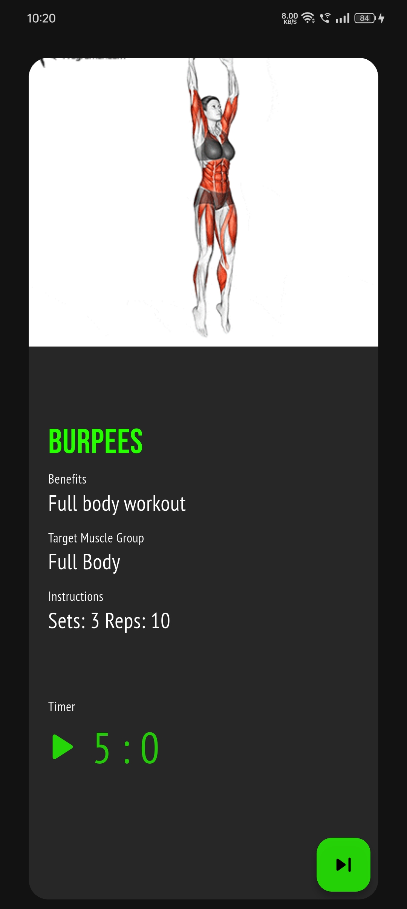
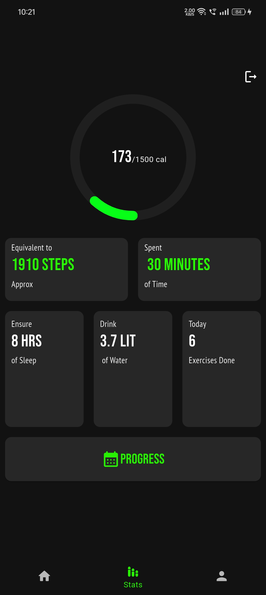
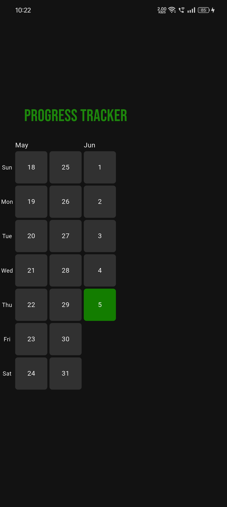
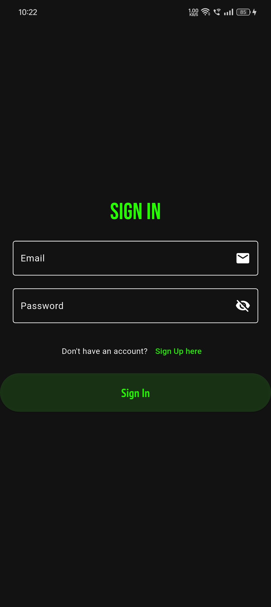
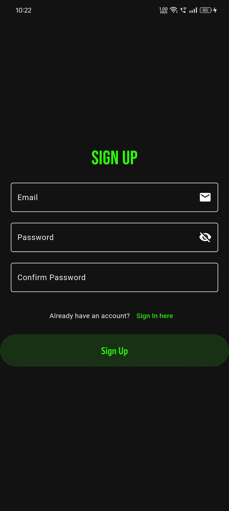

#  Personalized AI Chatbot & Fitness Guide App

A Flutter-based mobile application that combines the power of AI chat with a personalized fitness guide, offering users customized fitness plans, real-time chat support, and goal tracking. All in one intuitive platform.

---

##  Features

-  **AI Chatbot**

   Ask fitness and wellness questions
   
   Get instant responses with personalized suggestions

-  **Fitness Guide**

   Customized workout plans (home & gym)

   Categorized by goal: Beginner to Advanced levels

-  **Nutrition Tips**

   Basic meal suggestions aligned with goals

   Hydration and recovery advice

-  **Progress Tracking**
 
   Daily/weekly workout logs

   Goal-based reminders and milestone tracking

-  **Wellness Support**
  
   Meditation and sleep routines

   Breathing exercises and mental health tips


## Screenshots

### Home page and ChatBot
<div >
  


</div>

### Workouts
<div>
  
</div>

### Dashboard
<div>
  

</div>

## Login and Sign up Screens
<div>
  

</div>


---

---

##  Tech Stack

| Layer             | Technology     |
|------------------|----------------|
| Frontend         | Flutter        |
| State Management | Provider |
| AI Integration   | OpenRouter API |
| Data Storage     | Supabase Storage |
| Authentication   | Supabase Authentication |
| UI Components    | Material Design, Custom Widgets|

---


### Setup Instructions

```bash
git clone https://github.com/Dheeraj-Chintala/Android-Apps.git
cd fitness_app

```
Add OpenRouter API key and run 
```bash

flutter pub get
flutter run
```
